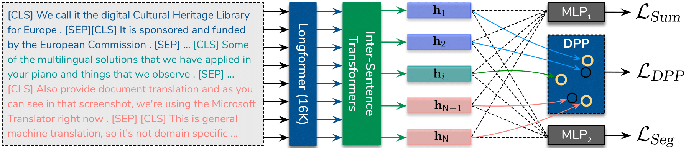

# Toward Unifying Text Segmentation and Long Document Summarization (Lodoss)
Our paper, ["Toward Unifying Text Segmentation and Long Document Summarization"](https://aclanthology.org/2022.emnlp-main.8/), is accepted at EMNLP 2022. If you find the code useful, please cite the following paper.

# Citation 🔖

    @inproceedings{cho-etal-2022-toward,
      title={Toward Unifying Text Segmentation and Long Document Summarization},
      author={Sangwoo Cho, Kaiqiang Song, Xiaoyang Wang, Fei Liu, and Dong Yu},
      booktitle={Proceedings of the 2022 Conference on Empirical Methods in Natural Language Processing},
      year={2022}
    }

## Quick Links
  - [Overview](#overview-)
  - [Environment](#environment-)
  - [Data](#data-)
  - [Train](#train-)
  - [Checkpoint](#checkpoint-️)
  - [Inference](#inference-)

## Overview 🔭
We propose a method learning robust sentence representations by performing summarization and segmentation simultaneously,
which is further enhanced by an optimizationbased regularizer to promote selection of diverse summary sentences.

1. ```Lodoss-base```: This is a traditional extractive summarization method which predicts probabilities of each 
   sentence being included in a summary.
2. ```Lodoss-joint```: This model is based on joint prediction of summarization and segmentation of higher context 
   (paragraph, section, etc.).
3. ```Lodoss-full```: This approach is further regularized by the DPP loss to be able to predict better summary 
   sentences.  

<div align='center'>


</div>

## Environment 🌐

Create the environment with conda and pip. 
```shell
conda env create -f environment.yml
conda activate lodoss
```
We have done experiments with the environment with python 3.9 and cuda 11.3. <br>(For other CUDA version, please 
install 
the corresponding packages)

## Data 💾
We provide the processed data: [PubMed](https://tencentoverseas-my.sharepoint.com/:u:/g/personal/swcho_global_tencent_com/EWh56at2ViNCpq0iyIZ1D8gBXFPFVs-ake58VinzbjRQsQ?e=RTtQwE),
[arXiv](https://tencentoverseas-my.sharepoint.com/:u:/g/personal/swcho_global_tencent_com/EaPgWveSHbdCrPERMvW4z5EBYuSqU6FcSJq17Mq1Vbih4w?e=NBsSQk), 
[VT-SSum](https://tencentoverseas-my.sharepoint.com/:u:/g/personal/swcho_global_tencent_com/ETflOwBVTktClHR9lH5xJ8oBY304Bz_EFRTJ2fexvNpTHQ?e=dS1vrz) 
* Original dataset can be downloaded from [PubMed, arXiv](https://github.com/armancohan/long-summarization), or 
  [VT-SSum](https://github.com/Dod-o/VT-SSum)
* Dataset format is based on [Hugging Face Datasets](https://huggingface.co/docs/datasets/index).
* Keys for data instance
  * ```article_id```: str
  * ```abstract_list```: List[str] / reference summary
  * ```section_list```: List[str] / document segmented by sections
  * ```section_names```: List[str] / names for each section
  * ```selected_ids```: List[int] / oracle summary ids


## Train 🚅
Please run the scripts under `/run`. For example:
```shell
cd Lodoss
bash run/train_pubmed_16K_base.sh
```
You need to update ```--data_dir``` with your data directory.

Some parameters to consider:
* ```--max_input_len 16384```: change ```4096``` to limit the input length
* ```--is_longer_seq```: this should be enabled for the sequence length longer than 4096
* ```--is_seg```: for ```Lodoss-joint``` model
* ```--is_dpp```: for ```Lodoss-full``` model, set ```--dpp_weight 0.1``` as well
* ```--fp16```: use this for ```Lodoss-base``` and ```Lodoss-joint``` models / due to numerical stability issue 
  of computing the DPP loss with ```Lodoss-full```, it is not recommended to use this parameter (fp32)
* ```--num_sent_inf 7```: number of sentences to select for inference / use ```7``` for ```PubMed```, ```5``` for 
  ```arXiv``` (which is the average number of the reference summary for each dataset) for the best results


## Checkpoint ☁️
If you'd like to download our trained models on Pubmed and arXiv, they are available here:

| Model              | PubMed | arXiv |
|--------------------| ----------- | ----------- |
| 16K_Lodoss-base    | [⬇️](https://tencentoverseas-my.sharepoint.com/:u:/g/personal/swcho_global_tencent_com/EesejsO1NhVIv-9rRX2HiYsBfp4hMl_QVxQ5krjgwc5PTw?e=8mogBd)          |[⬇️](https://tencentoverseas-my.sharepoint.com/:u:/g/personal/swcho_global_tencent_com/EYpsK5yXW2ZNmhVcmibMp4wBhNXTYQnJapYahpEtaaffqQ?e=lAfK1U)         |
| 16K_Lodoss-joint   | [⬇️](https://tencentoverseas-my.sharepoint.com/:u:/g/personal/swcho_global_tencent_com/EROXUHimEzFIixAjh2pkhV4Bz_O8ZdE04iYm3xDfDmv3qA?e=OgonG1)        |[⬇️](https://tencentoverseas-my.sharepoint.com/:u:/g/personal/swcho_global_tencent_com/EdExQ8yuog9Dl61rpMvUPb8BIYtc2N-XHbpxMR0L3mtu6Q?e=317pCc)        |
| 16K_Lodoss-full    | [⬇️](https://tencentoverseas-my.sharepoint.com/:u:/g/personal/swcho_global_tencent_com/Ec-LCDSiYf5Hit2CLeqm5QIBeG2zCwXrD9PwJ442MkbipQ?e=MM7Knk)        |[⬇️](https://tencentoverseas-my.sharepoint.com/:u:/g/personal/swcho_global_tencent_com/EbR42Kt5oBtBreRO51wOMP4BNl2kYrJhg-yr7FCPAZA63A?e=4LMm00)       |
| 16K_Lodoss-full-LG | [⬇️](https://tencentoverseas-my.sharepoint.com/:u:/g/personal/swcho_global_tencent_com/EemF3n4RJkxPiGSMtQ02-aMBjg1IVVvVuHLdpBr68RZZMg?e=4K7Rl1)        |[⬇️](https://tencentoverseas-my.sharepoint.com/:u:/g/personal/swcho_global_tencent_com/EU7Bf8YJ1NpJs-WMwqJWGmoBhz8_dmv2em_Nh6uqsJ9lIg?e=GTwKBn)       |


## Inference 🤔
With your own trained model or our provided pretrined models above, you can run inference on PubMed or arXiv.

```bash
cd Lodoss
bash run/test_pubmed_16K_base.sh
```

Please refer to the scripts under ```/run``` for running inference with other models. <br>
You can also save the summary by enabling ```--save_summary```.

## License 📜
   Copyright 2022 Tencent

   Licensed under the Apache License, Version 2.0 (the "License");
   you may not use this file except in compliance with the License.
   You may obtain a copy of the License at

       http://www.apache.org/licenses/LICENSE-2.0

   Unless required by applicable law or agreed to in writing, software
   distributed under the License is distributed on an "AS IS" BASIS,
   WITHOUT WARRANTIES OR CONDITIONS OF ANY KIND, either express or implied.
   See the License for the specific language governing permissions and
   limitations under the License.
   
## Disclaimer
This repo is only for research purpose. It is not an officially supported Tencent product. 